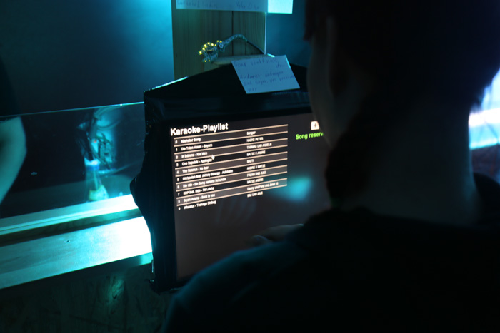

# Touchscreen project for Stecker student club
**2014 by Ferdinand Malcher, Tilmann Bach, Sven Walter, Danny Koppenhagen**

This project aims to provide a user interface and manager application for the [Stecker](http://club.hft-leipzig.de) student club.
If you have any suggestions, please feel free to contribute!

## Features
- [x] Karaoke Manager
	- Guests shall be able to register their desired karaoke songs on a touchscreen.
- [x] Pizza Order
- [x] Song wishlist
	- uses Spotify API for song lists 
- [ ] Image Slideshow

## Screenshots

